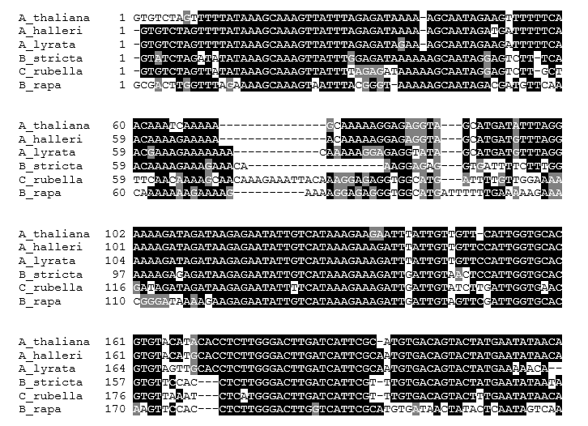
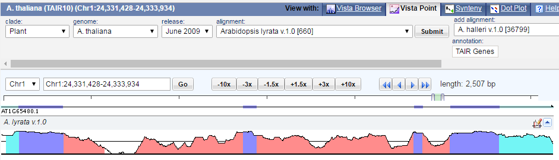
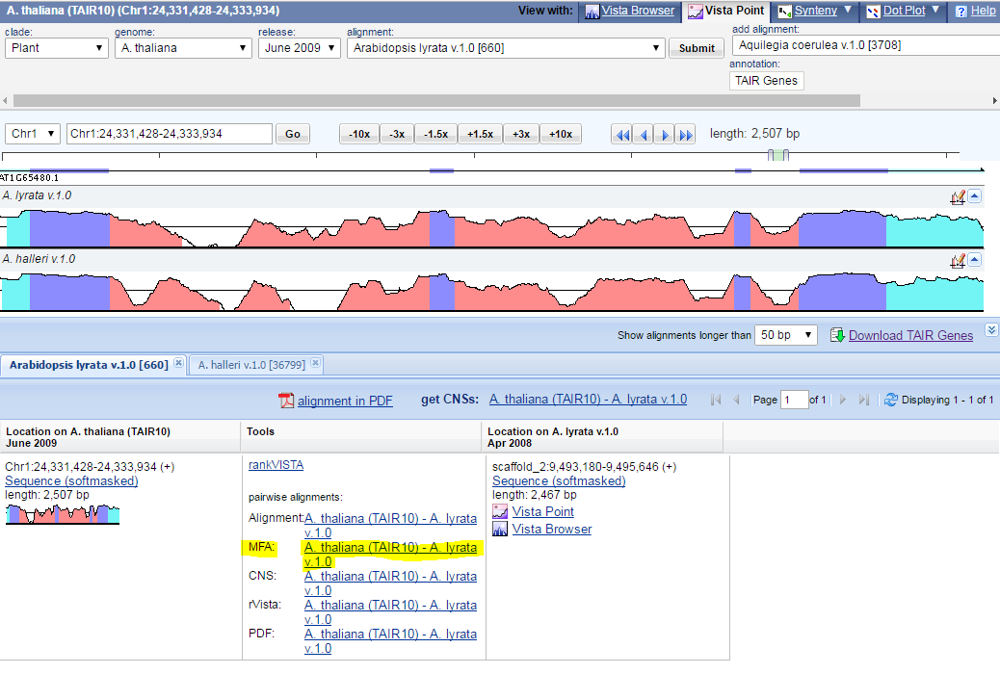
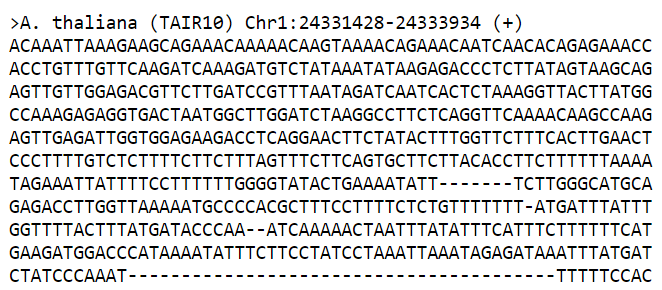

phylogenetic_shadowing
===

Pipeline to perform phylogenetic shadowing based on VISTA tools.

Example of phylogenetic shadowing between 6 related species from the Brassicaceae.

## In VISTA

* Go to http://pipeline.lbl.gov/cgi-bin/gateway2
* Select the clade and species (e.g. Plant, Arabidopsis thaliana)
* Enter as position the locus of interest (e.g. for FT, chr1:24331428-24333934)
* Select VISTA-Point mode for visualization

* Add then the desired species with ‘add alignment’ button, click ‘Add’
 

* Open in a new tab the file MFA indicated in the ‘Tools’ window
 

* Copy-paste the content in a text file
* Do the same for the other alignment but omit the first sequence which is already present (e.g. Arabidopsis thaliana). See [BlockE_conserved.txt](example/BlockE_conserved.txt).
* Change the name of the sequence so that it contains no spaces (error in Clustal Omega alignment) nor dots (error in BoxShade). The title should contain maximum 16 characters to be displayed fully once processed in BoxShade (e.g. “>Drummond's rockcress v.1.0 Scaffold26959:3697497-3698805 (-)” becomes “>B_stricta”)
* Put the alignments in the order wanted (the reference sequence is put first)

**Note**: VISTA tool provides scientific and vernacular plant names, which is not the best practice. Drummond's rockcress is *Arabidopsis drumondii*, also called *Boechera stricta*. They also have Turnip mustard and Napa cabbage which are the same species *Brassica rapa* but different cultivars (*Brassica rapa* subsp. *oleifera* and *Brassica rapa* subsp. *pekinensis*, respectively).

## In Clustal Omega

* Go to http://www.ebi.ac.uk/Tools/msa/clustalo/
* Choose ‘DNA’
* Copy paste the content of the text file with all species from VISTA `Input_Clustal_BlockE.txt` 
* In Step 2, click ‘More options’ and choose ‘input’ in the option ‘ORDER’ so that the order of the user is respected in the final display
* Submit the job
* Click on ‘Download Alignment File’
* To be processed in BoxShade, the file needs to be modified. For this, the script [clustalOmega2BoxShade.py](clustalOmega2BoxShade.py) can be used on a Linux/Unix system with Python 2.7 or 3.4 installed. The script converts the Clustal output into a FASTA format 
* Enter in command line: `python clustalOmega2BoxShade.py Output_Clustal_BlockE.txt > Input_BoxShade_BlockE.txt`
* The content of the output file `Input_BoxShade_BlockE.txt` can be used in BoxShade webtool. See [Input_BoxShade_BlockE.txt](example/Input_BoxShade_BlockE.txt)

## In BoxShade

* Go to http://www.ch.embnet.org/software/BOX_form.html
* Select ‘RTF_new’ as output format 
* Select as ‘ALN’ as input sequence format
* Copy and paste the content of `Input_BoxShade_BlockE.txt` in the input box
* Download the output RTF file (can be opened in Word and exported as pdf). See [Output_BoxShade_BlockE.rtf](example/Output_BoxShade_BlockE.rtf)

The output should look like:

# Author

* Johan Zicola
